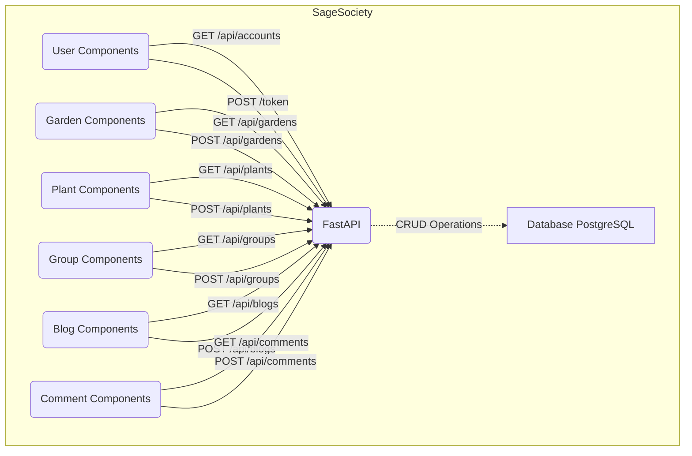

# SageSociety

Project Team:

- **(Nate Axness)** - Gardens
- **(Nick De La Flor)** - Plants
- **(Joshua Scott)** - Groups
- **(Alec Weinstein)** - Blogs

# Intended Market:
 - The target market for SageSociety are entry-level/hobbyist gardeners who are looking for a one-stop application to help them manage their garden from setup to harvest.

# Functionality:
 - Users are able to visit the site, register for an account, create a virtual garden to help manage their IRL garden, add plants to that garden, create a blog to document their garden’s progress, and join an online community of fellow gardeners.
 - Registration to the site unlocks all the features of SageSociety:
 - Users can create multiple virtual gardens in which they can,
   Show details of that garden, such as sun exposure, garden types (ie raised bed, in ground, hydroponic, etc…), soil pH.
 - View real-time weather conditions at each garden’s zip-code.
 - Locate a soil testing facility in their area.
 - Users can add Plants to their Gardens to,
 - Document when the plant was planted.
 - Show off pictures of their plant to the rest of SageSociety.
 - Receive interesting details about each plant.
 - Receive custom AI-generated care instructions for each plant in their garden.
 - Users can create a Blog to:
   use as a journal that documents their gardening journey.
   share their garden progress with the world.
 - Users can create Groups to:
   communicate with fellow Sages.
   explore communities to learn more about regional gardening.


## How to Run this App

**Pre-reqs: Git, Docker**

1. Fork the repository; clone its files to your local machine using the terminal command below: - `git clone <<Clone with HTTPS link>>`
   ​
2. Build and run the project with the following Docker commands in your terminal:
   ```
   docker volume create postgres-data
   docker-compose build
   docker-compose up
   ```
3. Verify that each Docker container is running; there should be (3) in total:

   - postgres-data (PostgreSQL)
   - ghi-1 (Front-end React Application)
   - fastapi-1 (Back-end FastAPI Service)

4. You can view the SageSociety web app in your browser @ http://localhost:3000/.

## Diagram



​

# API Documentation

## URLs and Ports

1. SageSociety Web App:
   - http://localhost:3000/
2. FastAPI Backend:
   - http://localhost:8000/docs/

## Backend FastAPI

For this microservice, we utilized the following models (and properties) listed below:

1. Model: 'Accounts'

   - username
   - password
   - first name
   - last name
   - email
   - phone number

2. Model: 'Gardens'

   - gardens_id (primary key)
   - gardens_name
   - description
   - accounts_id (foreign key referencing 'Accounts')

3. Model: 'Plants'

   - plants_id (primary key)
   - plants_name
   - planted_date (timestamp)
   - description
   - gardens_id (foreign key referencing 'Gardens')

4. Model: 'Groups'

   - groups_id (primary key)
   - groups_name
   - description

5. Model: 'Groups_members'

   - groups_id (foreign key referencing 'Groups')
   - accounts_id (foreign key referencing 'Accounts')
   - (composite primary key on groups_id and accounts_id)

6. Model: 'Groups_comments'

   - comments_id (primary key)
   - content
   - authors_id (foreign key referencing 'Accounts')
   - groups_id (foreign key referencing 'Groups')
   - created_at (timestamp with default value)

7. Model: 'Blogs'

   - blogs_id (primary key)
   - accounts_id (foreign key referencing 'Accounts')
   - title

8. Model: 'Blogs_post'

   - blogs_post_id (primary key)
   - blogs_id (foreign key referencing 'Blogs')
   - title
   - picture_url
   - text

9. Model: 'Blogs_post_comment'
   - blogs_post_comment_id (primary key)
   - accounts_id (foreign key referencing 'Accounts')
   - blogs_post_id (foreign key referencing 'Blogs_post')
   - text

## Localhost:8000/docs

| Action        | URL                        |     |     |     |
| ------------- | -------------------------- | --- | --- | --- |
| All Endpoints | http://localhost:8000/docs |     |     |     |


## Deployed site
| Action | URL                                                    |     |     |     |
| ------ | ------------------------------------------------------ | --- | --- | --- |
| Web    | https://04-floridaman.gitlab.io/module3-project-gamma/ |     |     |     |


The other directories, `ghi` and `api`, are services, that
you can start building off of.

Inside of `ghi` is a minimal React app that has an "under
construction" page. It is setup similarly to all of the
other React projects that you have worked on.

Inside of `api` is a minimal FastAPI application.
"Where are all the files?" you might ask? Well, the
`main.py` file is the whole thing, and go take look inside
of it... There's not even much in there..., hmm? That is
FastAPI, we'll learn more about it in the coming days. Can
you figure out what this little web-application does even
though you haven't learned about FastAPI yet?

Also in `api` is a directory for your migrations.
If you choose to use PostgreSQL, then you'll want to use
migrations to control your database. Unlike Django, where
migrations were automatically created for you, you'll write
yours by hand using DDL. Don't worry about not knowing what
DDL means; we have you covered. There's a sample migration
in there that creates two tables so you can see what they
look like.

The Dockerfile and Dockerfile.dev run your migrations
for you automatically.

### Other files

The following project files have been created as a minimal
starting point. Please follow the guidance for each one for
a most successful project.

- `docker-compose.yaml`: there isn't much in here, just a
  **really** simple UI and FastAPI service. Add services
  (like a database) to this file as you did with previous
  projects in module #2.
- `.gitlab-ci.yml`: This is your "ci/cd" file where you will
  configure automated unit tests, code quality checks, and
  the building and deployment of your production system.
  Currently, all it does is deploy an "under construction"
  page to your production UI on GitLab and a sample backend
  to CapRover. We will learn much more about this file.
- `.gitignore`: This is a file that prevents unwanted files
  from getting added to your repository, files like
  `pyc` files, `__pycache__`, etc. We've set it up so that
  it has a good default configuration for Python projects.
- `.env.sample`: This file is a template to copy when
  creating environment variables for your team. Create a
  copy called `.env` and put your own passwords in here
  without fear of it being committed to git (see `.env`
  listed in `.gitignore`). You can also put team related
  environment variables in here, things like api and signing
  keys that shouldn't be committed; these should be
  duplicated in your deployed environments.

## How to complete the initial deploy

There will be further guidance on completing the initial
deployment, but it just consists of these steps:

### Setup GitLab repo/project

- make sure this project is in a group. If it isn't, stop
  now and move it to a GitLab group
- remove the fork relationship: In GitLab go to:

  Settings -> General -> Advanced -> Remove fork relationship

- add these GitLab CI/CD variables:
  - PUBLIC_URL : this is your gitlab pages URL
  - REACT_APP_API_HOST: enter "blank" for now

#### Your GitLab pages URL

You can't find this in GitLab until after you've done a deploy
but you can figure it out yourself from your GitLab project URL.

If this is your project URL

https://gitlab.com/GROUP_NAME/PROJECT_NAME

then your GitLab pages URL will be

https://GROUP_NAME.gitlab.io/PROJECT_NAME

### Initialize CapRover

1. Attain IP address and domain from an instructor
1. Follow the steps in the CD Cookbook in Learn.

### Update GitLab CI/CD variables

Copy the service URL for your CapRover service and then paste
that into the value for the REACT_APP_API_HOST CI/CD variable
in GitLab.

### Deploy it

Merge a change into main to kick off the initial deploy. Once the build pipeline
finishes you should be able to see an "under construction" page on your GitLab
pages site.
